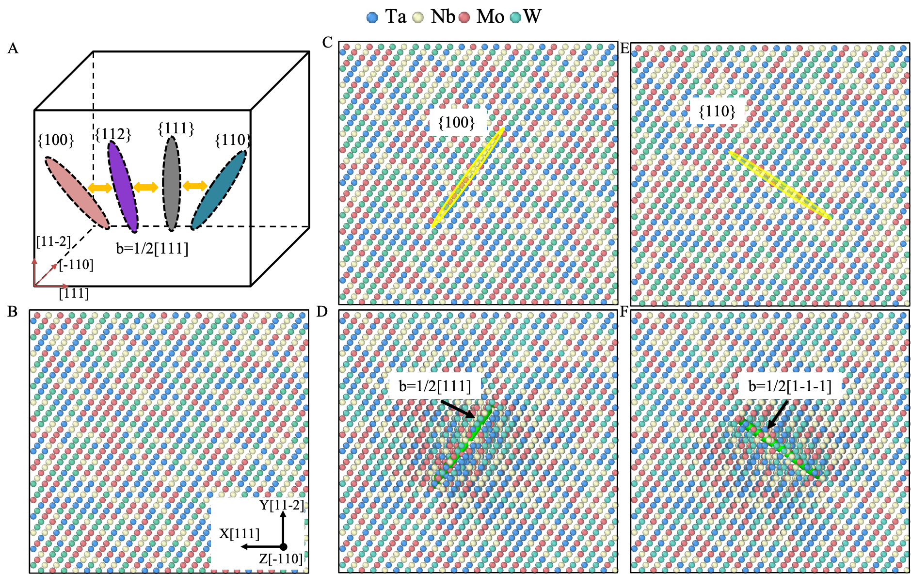

[Add-Displace Pipeline]


In the BCC crystal structure, such as in BCC Fe and Fe-based alloys, the formation and behavior of $\frac{1}{2}<111>$ prismatic interstitial dislocation loops have long attracted extensive interest because of their critical importance to both the mechanical behavior under normal conditions, and the radiation response under irradiation. The complex configurations of interstitial dislocation loops can be characterized by their habit plane and Burgers vector. Experimental observations and simulations have shown that a single $\frac{1}{2}<111>$ loop in BCC Fe may exhibit a habit plane change between $\{100\}$, $\{111\}$, $\{110\}$, and $\{211\}$ planes \cite{21, 22}. In recent research, atomistic simulations were employed to explore the gliding of a $\frac{1}{2}<111>$ loop and provide direct evidence of the change of habit plane.

In this part, we utilize MagicDislocation to construct $\frac{1}{2}<111>$ interstitial dislocation loops located in different habit planes in a BCC TaNbMoW HEA. As shown in Fig. A, to investigate the transformation behavior of $\frac{1}{2}<111>$ interstitial dislocation loops in the four possible habit planes, we only need to construct initial and final states of the loops in the habit planes $\{100 \}$ and $\{110 \}$; the intermediate states can be obtained using the NEB method. Fig. B shows an initial TaNbMoW HEA without defect. To construct  dislocations, we first layerize the atoms along $\{100\}$ planes and define a closed dislocation loop. Then, we insert a layer of $\{100\}$ atoms with the appropriate topological stacking directly onto one of the $\{100\}$ planes (Fig. C). By calculating the displacement of the atoms, we generate a $\frac{1}{2}<111>$ dislocation on the $\{110\}$ plane (Fig. D). Using the same method, a $\frac{1}{2}<111>$ interstitial dislocation loop on the $\{100\}$ plane is constructed.



Setup of $\frac{1}{2}<111>$ interstitial-dislocation loop in different habit planes. A. Schematic of the possible habit planes $\{111\}$, $\{110\}$, $\{112\}$ and $\{100\}$. B. Initial perfect TaNbMoW structure. C-D. of $\frac{1}{2}<111>$ dislocation loop lying in $\{100\}$; E-F. of $\frac{1}{2}<111>$ dislocation loop lying in $\{110\}$.


We provide the parameters to build the dislocation loop whose slip plane's direction is $\{ 110 \}$ via the GUI method, as shown in 110_habit_plane/interface_bcc_110.png. In this case, we create the dislocation for a BCC system by inserting a new half layer and then moving atoms, so we need to use the Add-Displace pipeline. The direction of the crystal of the system is: $X:1 1 1, Y:1 1 -2, Z:-1 1 0$. In addition, we keep the layerization direction the same as the direction of the S plane for the simplicity of inserting new atoms and $(1, 1, 0) = 2*X + 1*Y + 0*Z$. So, the layerization direction is $(2*\sqrt3, \sqrt6, 0)$ and its normalization result is $(\sqrt2, 1, 0)$. For S Plane Setting, we indicate the center position and initial direction. We let the rotated directon be optional, and the MagicDislocation will rotate the S plane to the layerization direction automatically when the layerization direction is different from the initial direction and the rotated direction is optional. Moreover, we know that the Burgers vector is parallel to the X-axis, and we should move the atoms towards the X-axis. The norm of the dislocation is 0.5 * $\sqrt3$ = 0.866. So, the vector in the moving direction should be $(0.866, 0, 0)$ in the Cartesian coordinate system. In addition, the construction of this dislocation is based on the addition of new atoms. Here, we choose to insert atoms into the space between 20-th and 21-st layer atoms, and we can set the Layer Range for Adding to (20, 21) to achieve this.

Besides, we also provide a new_config.yaml containing parameter settings for command-line runing method.
All related parameters can be found in interface_bcc_110.png and new_config.yaml. Users can run them via the following two ways:

```
bash scripts/run_based_ui.sh
```


or

```
cd magic_dislocation
python run.py \
    --yaml_file '../examples/bcc/100_habit_plane/new_config.yaml'
```

We also use the same method to construct the dislocation lying in the habit plane $\{ 100 \}$. Users can check parameters in directory 100_habit_plane.
