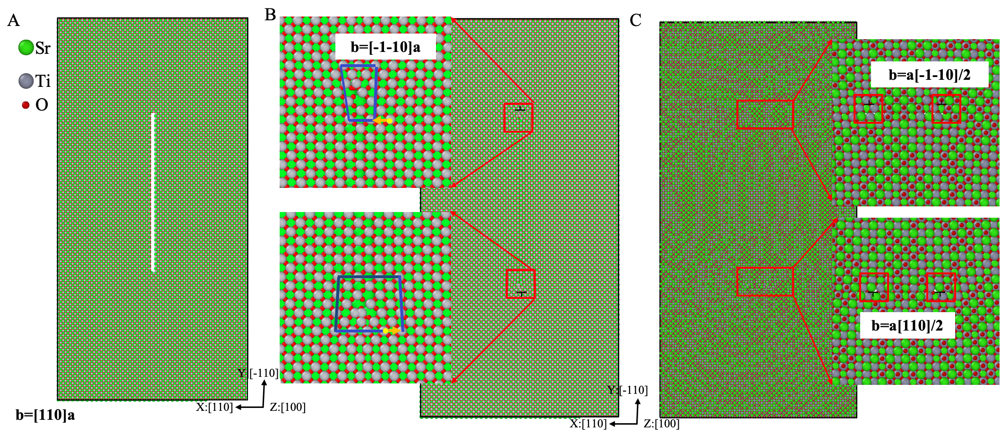

The effect of dislocations on the chemical, electrical, and transport properties of oxide materials is important for electrochemical devices, such as fuel cells and resistive switches, but these effects have remained largely unexplored at the atomic level \cite{23}. In this part, we take SrTiO3, a prototypical perovskite oxide, as an example to present the application of our method by constructing a $<100>$ edge dislocation. Previous experimental and MD simulation have observed and confirmed the dissociation and escalation of $\frac{1}{2}<110>$ dislocations at high temperatures, which impact the local defect chemistry and oxide ion transport. The construction and optimization procedure is shown in the following fiture. Dislocations in perovskite are more difficult to set than those in elemental metals because of the polar character of these oxides and associated charge effects at the dislocation core or boundaries of simulation cells. In addition, ternary stoichiometry may be affected when a dislocation is introduced. To overcome this challenge, two noninteracting dislocations with opposite Burgers vectors, $<110>$ in the $\{110 \}$ S plane, were constructed in a large enough box. Thus, the dislocation circuit plane on the S plane along the dimensions y and z was defined within the box, while the boundary of the x-direction far exceeds the box. For $<110>$ vacancy-type dislocation, four atomic planes are removed, including two SrO and two TiO2 planes (Fig. A). After calculating the displacement and displacing atoms, two opposite $<110>$ dislocations are formed in SrTiO3. To obtain the accurate dislocation structure, energy minimization was performed. As shown in the following figure, the $<110>$ dislocation dissociates into two same $\frac{1}{2}<110>$ edge dislocations. 





Here, we provide the parameters to build the $<110>$ dislocation loop via the GUI method, as shown in figure interface_SrTiO3.png. In this case, we delete a layer of atoms to construct this dislocation, so we use the Delete-Displace pipeline. The direction of the crystal of the system is: $X:110, Y:-110, Z:001$. The direction of layerization and the direction of the S plane are $(1,0,0)$. Then, we set the length and width of the rectangle to 600 and 45, which could be adjusted by the user. The Burgers vector is $<110>$, so we displace the atoms towards $(\sqrt2, 0, 0)$.


Besides, we also provide a new_config.yaml containing parameter settings for command-line runing method.
All related parameters can be found in interface_SrTiO3.png and new_config.yaml. Users can run them via the following two ways:

```
bash scripts/run_based_ui.sh
```


or

```
cd magic_dislocation
python run.py \
    --yaml_file '../examples/z cubic/SrTiO3/new_config.yaml'
```