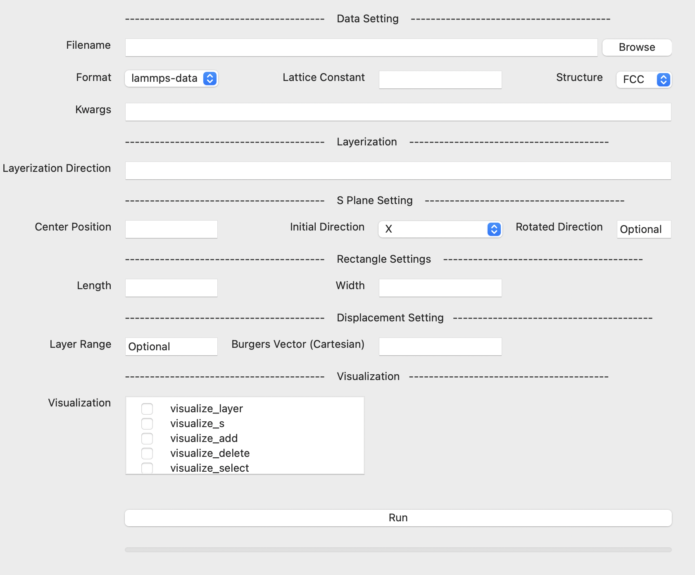
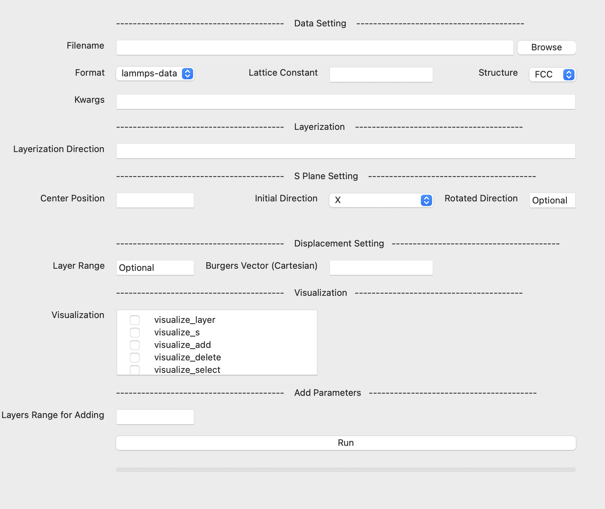
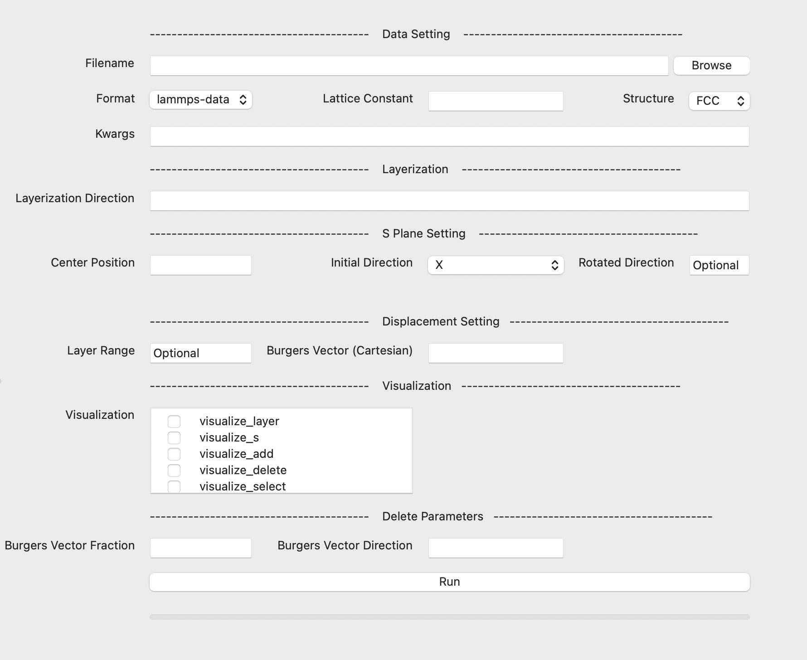
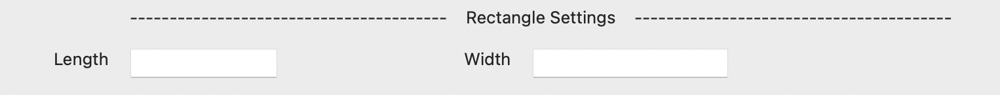
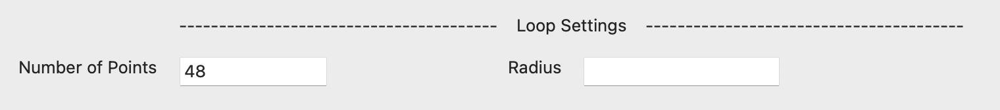
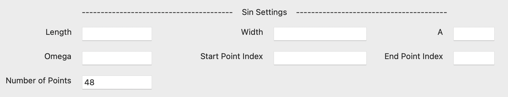
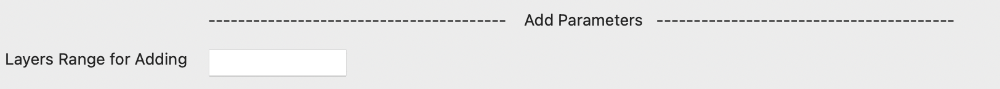
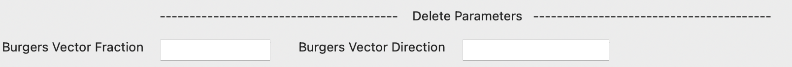

# 1. Introduction

Magic Dislocation is a dislocation construction software designed for users with a foundational understanding of dislocation theory. It provides flexible functionality for selecting, adding, deleting, modifying, moving, and visualizing atoms within a system. Compared to other dislocation software such as Atomsk, Magic Dislocation, based on the Continuum Dislocation Theory, establishes a direct link between dislocation construction and the movement of specific atoms. This approach offers greater flexibility, allowing users to construct dislocations at arbitrary positions, of arbitrary sizes, and with various shapes within complex crystal structures.


## MagicDislocation's Pipleline for Constructing Dislocation

The dislocation can be obtained by moving certain atoms in the system according to the system information and burgers vector. For some special dislocations, we need to delete or add atoms in the process of creatation.

The core of the dislocation creation is calculating the moving distance of each atom. Here, we following the calculation in paper 

`
MagicDislocation: A Flexible Dislocations Construction Toolkit Based on Continuum Dislocation Theory
`

We use the following figure to demonstrate the working pipelines of our software. Before that, we need to give explanations for certain concepts in these pipelines.

### Concept Explanations:
    - Data: 
        ASE is a famous python library for atom simulation calculation. We integrate the ASE Input-Output (IO) into our software, so it can take any data could be processed by ASE IO as input.

    Note: One axis of the system should be the direction of burgers vector when you construct your atom system file!

    - S plane:
        The method we use to create dislocation requires us to provide a virtual plane to calculate the solid angle for each atom to this plane and then calculate the moving distance based on the solid angle. Here, we call this virtual plane "S plane". In our software, the S plane's edge in the system represents the shape of dislocation line. It could be line, rectangle and loop.

    - Layerization: 
        We layerize the atoms in the given systems for operating these atoms easily. For example, when we need to add new atoms, we can just copy certain layers of atoms and then paste them to the corresponding position. To realize layerization, the user should provide a layerization direction vector. Usually, we keep the direction vector of S plane same as the layerization direction vector.

    - Delete, Add, Move
        Operations on atoms. For some dislocation, just moving atoms can not make sure obtaining dislocation. In this case, We may need to delete or add atoms in certain layers and shapes. （Depending on the type of dislocation, vacancy-type or interstitial-type dislocations (e.g., edge dislocation, 1/3<111> dislocation loop) require the removal or addition of atomic planes. For displacement-type dislocations, atomic movement is necessary (e.g., 1/6<112> dislocation loop, screw dislocation).）


To create different types of dislocations, we design three pipelines: Move, Add-Move and Delete-Move.
### Move Pipeline
      Steps:
        0. Read atom system via ASE library.
        1. Layerize the system based on atom positions and layerization direction vector.
        2. Define S plane's size and shape.
        3. Select Atoms should be moved.
        4. Calculate the distance the Atoms should move.
        5. Move selected atoms.
        6. Outuput New files.
    
### Add-Move Pipeline
      Steps:
        0. Read atom system via ASE library.
        1. Layerize the system based on atom positions and layerization direction vector.
        2. Define S plane's size and shape
        3. Copy atoms in certain layers to S plane's position.
        4. Select atoms should be moved.
        5. Calculate the distance the atoms should move.
        6. Move selected atoms.
        7. Outuput new files.

### Delete-Move Pipeline
      Steps:
        0. Read atom system via ASE library.
        1. Layerize the system based on atom positions and layerization direction vector.
        2. Define S plane's size and shape.
        3. Select atoms in certain layers to delete.
        4. Select atoms should be moved.
        5. Calculate the distance the atoms should move.
        6. Move selected atoms.
        7. Outuput new files.


# 2. Features
- Support different dislocation shapes, including line, rectangle, loop.
- Support the visulization of each stage in the whole pipeline.

# 3. Installation
git clone this respository.

```
cd ase
pip install -e .
cd ..
pip install -e .
```

Note:
```
Due to the defects in original ASE IO lammpsdata.py file, the output file has an error cell (axis's left endpoint is set to 0). To fix it, we rewrite the output parts of the lammpsdata.py of ase.io package in magic_dislocation.
```

# 4. Usage

There are two ways to start the construction. One is call the run_v1.py file based on interface. Another is call the run.py file by pass a yaml file containing necessary parameters to it. In the next, we will introduce two methods in detail.


## 4.1 Inferface Usage

```
cd magic_dislocation
bash scripts/run_based_ui.sh
```

Passing related parameters via the interface.

There are three kinds of interface in our software: Move, Add-Move and Delete Move. 

### Move Pipeline

### Add-Move Pipeline

### Delete-Move Pipeline


They have some common input boxes and some unique input boxes. Here, we will introduce each input box in our interface. 

The first part is the common input boxes.

- Filename: the path of the data file.
- Format : the data format, same as the ASE IO. (only support lammpsdata now.)
- Lattice Constant: the lattice constant of the system.
- Structure: the structure of the system (FCC, BCC, Cubic).
- Kwargs: the other parameters required by ASE IO.
- Layerization Direction: the direction vector used to layerize atoms according to their positions.
- Center Position: the center position of S plane.
- Initial Direction: the initial direction vector of S plane. Usually, we first define a S plane whose direction vector is parallel to an axis. If we need a S plane whose direction vector is not parallel to any axis, we will rotate this initial S plane according to the given rotation direction.
- Rotated Direction: if we need to rotate the S plane, we should provide a rotated direction vector based on the inital direction vector. Both two direction vectors are given in cartesian coordinate. If we do not give this parameter and the layerization is different from the initial direction, this parameter will be set to layerization direction.
- Layer Range: usually, we move all atoms of the system to create the dislocation. However, in some special situations, we can only move certain atoms. This parameter can select atoms to move based on their layerization information.
- Burgers Vector: the burgers vector in the cartesian coordinate. The direction is usually the direction of an axis. The norm is the norm of burgers vector.
- Visualization: choose to visualze stages in the creation of dislocation.

As mentioned before, we have three types of dislocation lines: rectangle, loop and line. Each pipeline can produce these three types of dislocation lines. These three dislocation lines require different parameters.

### Rectangle


- Length: the length of rectangle.
- Width: the width of rectangle. 

### Loop


- Number of Points: the number of points consisting of the loop line.
- Radius: the radius of the loop.

### Line
The line dislocation is one of edges of rectangle in the system. Other edges are out of the system. Besides the normal line, we also can let user create some special lines, like sin line.


- Length: the length of rectangle.
- Width: the width of rectangle.
- A: A of the sin function A*Sin(Omega * X).
- Omega: Omega of the sin function A*Sin(Omega * X).
- Start Point Index: the index of point in rectangle as the start of sin line.
- End Point Index: the index of point in rectangle as the end of sin line.
- Number of Points: the number of points consisting of Sin line.


The second part is about unique parameters.
### Add-Move

- Layers Range for Adding: The layer range of atoms we copy to add new atoms.

### Delete-Move

- Burgers Vector Fraction: the fraction of burgers vector.
- Burgers Vector Direction: the direction of burgers vector.

For 1/2 <110>, the fraction is 1/2 and the direction is (1, 1, 1). This information is used to determine the range of atoms should be deleted.


## 4.2 YAML Usage

We arrage the needed parameters (similar to the parameters in interface) in a yaml file. Users can check detailed format in examples directory.